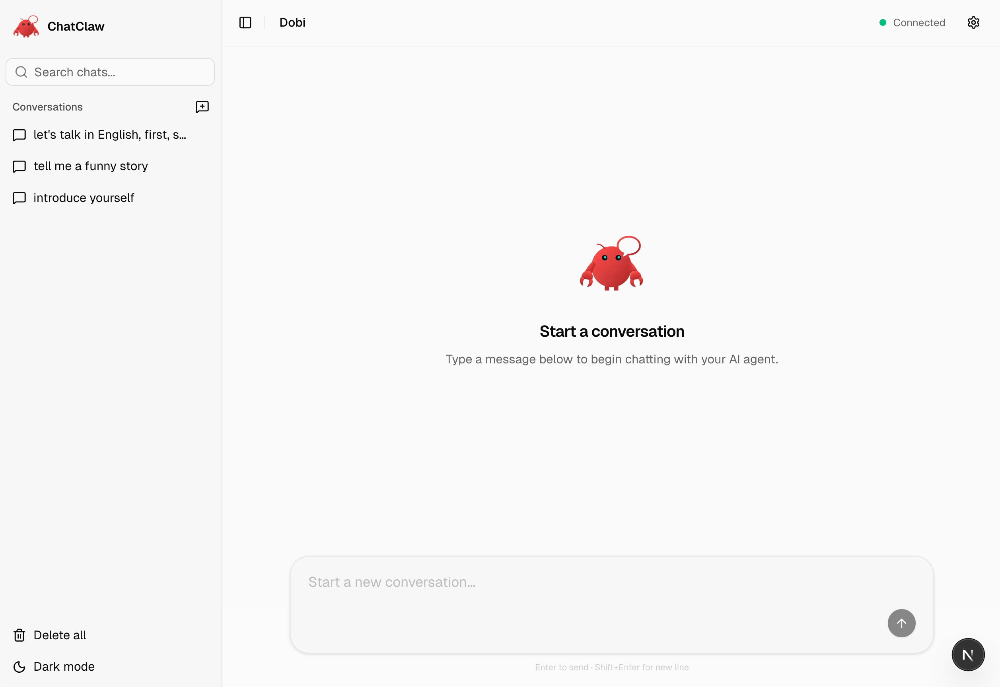

# ChatClaw

A polished, open-source web chat client for [OpenClaw](https://github.com/openclaw/openclaw) Gateway.

Think ChatGPT/Claude.ai UX, but connecting to your own OpenClaw agent.



## Features

- 🔌 Connect to any OpenClaw Gateway via WebSocket
- 💬 Multi-conversation support with sidebar
- ⚡ Real-time streaming responses
- 📝 Markdown rendering with syntax highlighting
- 🎨 Dark/light theme (Claude.ai-inspired dark theme by default)
- 💾 All data stored locally in IndexedDB (zero backend)
- 📱 Responsive design (desktop + mobile)
- 🔒 Your keys stay in your browser

## Quick Start

```bash
# Clone
git clone https://github.com/idoubi/chatclaw.git
cd chatclaw

# Install dependencies
bun install

# Run dev server
bun run dev
```

Open [http://localhost:3000](http://localhost:3000), enter your OpenClaw Gateway URL (`ws://host:port`) and token, and start chatting.

## Tech Stack

- **Next.js 16** — App Router, TypeScript
- **Tailwind CSS** + **shadcn/ui** — UI components
- **Dexie.js** — IndexedDB for local storage
- **WebSocket** — OpenClaw Gateway protocol v3
- **react-markdown** — Markdown rendering with syntax highlighting

## OpenClaw Gateway

ChatClaw connects to an [OpenClaw](https://github.com/openclaw/openclaw) Gateway instance via WebSocket. You need a running Gateway with:

- WebSocket endpoint accessible (e.g. `ws://127.0.0.1:18789`)
- An auth token configured

## Development

```bash
bun run dev      # Start dev server
bun run build    # Production build
bun run lint     # Lint
```

## License

This project is open-source and available under the [MIT License](./LICENSE).
